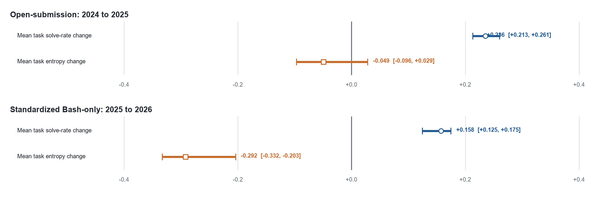
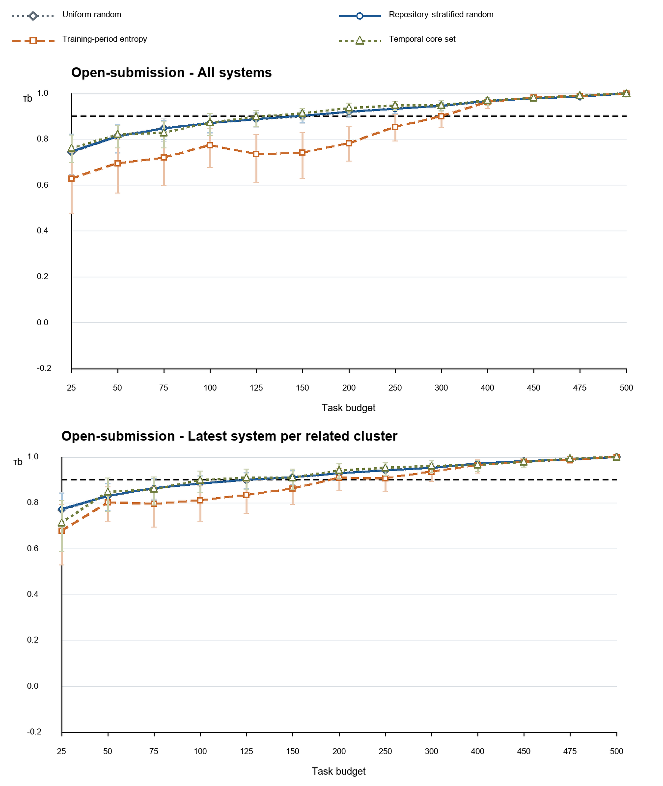
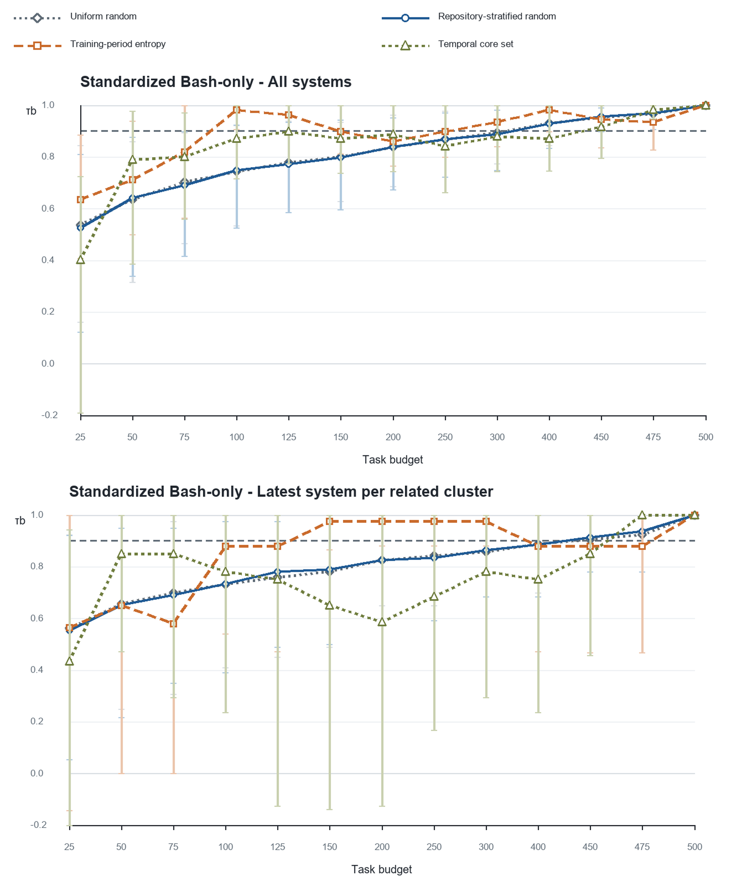
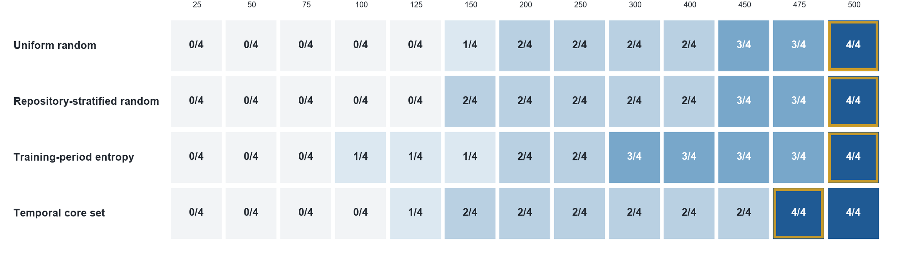

# Limits of Task-Set Reduction in SWE-bench Verified: A Temporal Study of Leaderboard Ranking Reliability

Anonymous manuscript for review

Target journal: *Empirical Software Engineering*

## Abstract

Coding-agent leaderboards make smaller task sets attractive, but a subset is
useful only if it preserves the ranking of later systems. We test this
time-forward requirement on the 500 SWE-bench Verified tasks in two separate
panels: open submissions from 2024 to 2025 (51 earlier and 78 later systems)
and standardized Bash-only submissions from 2025 to 2026 (27 and 11 systems).
Earlier outcomes select tasks at 13 budgets using uniform random,
repository-stratified random, entropy, and a frozen temporal core-set
procedure. We measure held-out fidelity with Kendall’s τ_b, a tie-aware top-k
Jaccard diagnostic, and all-system and latest-per-related-cluster scopes. A
harmonized curve bootstrap resamples held-out system clusters for every method
and additionally redraws tasks for stochastic procedures. Later cohorts had
higher mean solve rates; entropy declined clearly only in the standardized
panel. Under the protocol-defined pointwise policy, the common reliable
procedure budgets were 500, 500, 500, and 475 tasks, respectively. A
reviewer-motivated, post hoc joint max-t analysis returned the same budgets;
an unstandardized raw-deviation band instead forced all four to 500. Entropy
was also non-monotone,
passing at 150–300 tasks but failing at 400–475 in one scope. Task identities
varied across scope-trained selectors, so a common budget does not denote one
fixed public subset. Thus, no procedure supported more than a 5% reduction
under the primary policy, and even that saving was not a fixed deployable set.
Maintainers should validate
selection procedures on later systems, model related submissions, and report
curve-wise selection uncertainty rather than assume fidelity increases with
budget.

**Keywords:** coding agents; benchmark reduction; leaderboard reliability;
SWE-bench Verified; temporal validation; ranking uncertainty

## 1 Introduction

Repository-level coding agents are commonly compared by the fraction of
benchmark tasks they resolve. SWE-bench made this evaluation setting concrete
by connecting real GitHub issues to repository snapshots, pull requests, and
executable tests (Jimenez et al. 2024). SWE-bench Verified subsequently retained 500 tasks after
human review of problem statements and test adequacy (OpenAI 2024). Public leaderboards
then accumulated many submissions that differed in models, scaffolds, dates,
and execution conventions.

Executing fewer tasks is an appealing way to reduce evaluation burden. The
idea resembles test-suite reduction: retain a smaller set that preserves the
property needed by the user (Yoo and Harman 2012). For a leaderboard, however, the relevant
property is not merely task coverage or fault detection. A reduced set must
preserve comparative conclusions among systems. A subset that reproduces the
current ranking can still fail when stronger or differently structured systems
arrive. It can also appear reliable when a leaderboard contains many closely
related variants of the same agent or model provider.

This creates a temporal measurement problem. Suppose task outcomes from an
earlier period are used to choose a subset. The subset is then applied to later
systems, and its induced ranking is compared with the ranking produced by all
500 tasks. The key question is not whether one can fit the observed
leaderboard, but whether the compressed measurement transfers forward. This
distinction matters because benchmarks, tools, and experimental subjects evolve
(Golmohammadi et al. 2026), and because out-of-sample validation and transparent reporting remain
uneven in empirical software engineering (Destefanis et al. 2026).

The need for maintenance has become more explicit since the data snapshot used
in this study. In February 2026, OpenAI reported that SWE-bench Verified no
longer provided a suitable signal for frontier coding capabilities because of
residual task flaws and contamination, and recommended moving to newer
evaluations (OpenAI 2026). Our study does not dispute or repair those construct-validity
problems. Instead, it treats the frozen public leaderboard as a historical
measurement system and asks a narrower methodological question: within that
system, how much task reduction preserves later rankings? The distinction
between outcome correctness and ranking fidelity is essential. Work such as
SWE-Bench+ and UTBoost examines whether benchmark tasks and tests correctly
accept solutions (Aleithan et al. 2024; Yu et al. 2025); we examine whether a subset of the recorded outcomes
preserves system ordering.

We make four contributions.

1. We instantiate ranking-preserving benchmark reduction for coding agents as
   a time-forward evaluation, complementing general benchmark-compression work
   rather than claiming the first study of subset selection.
2. We construct two non-pooled temporal panels from frozen official sources,
   reconcile included matrices to public scores, and distinguish all systems
   from the latest system in each related family or provider cluster.
3. We evaluate four selection procedures over 13 budgets with task- and
   system-side uncertainty, curve-wise resampling, tie-aware diagnostics,
   threshold sensitivity, and a mandatory 500-task positive control.
4. We report a limitation finding and disclose its analysis history: a
   475-task procedure-level result under the protocol-defined pointwise rule
   is tested with a reviewer-motivated, post hoc simultaneous analysis rather
   than described as a confirmatory result.

The practical implication is procedural rather than algorithmic. A task subset
should be versioned and revalidated as a benchmark population changes. The
validation must use future systems where possible, account for related
submissions, and avoid monotonicity assumptions that the observed fidelity
curves do not support.

## 2 Background and Related Work

### 2.1 Coding-agent benchmarks and SWE-bench Verified

SWE-bench evaluates whether a model or agent can modify a real repository to
resolve a GitHub issue (Jimenez et al. 2024). The original benchmark contained 2,294 problems
across 12 Python repositories. SWE-bench Verified was built after professional
developers reviewed 1,699 tasks; 500 were selected as a human-validated subset
(OpenAI 2024). The public ecosystem subsequently became a central comparison point for
coding agents.

That ecosystem is heterogeneous. Martinez and Franch (2026) characterize the
participants, products, model choices, and openness of SWE-bench leaderboard
entries, showing that leaderboard rows are not interchangeable independent
samples. Our panel design responds by separating the open-submission and
standardized Bash-only formats and by adding related-system sensitivity rather
than pooling every row into one analysis.

The current status of SWE-bench Verified also limits how results should be
read. OpenAI's 2026 audit reports residual test-design problems and evidence of
contamination among frontier models (OpenAI 2026). Consequently, we do not claim that a
preserved historical SWE-bench Verified ranking measures current real-world
software engineering capability. The benchmark is the bounded empirical case
through which we study a general maintenance problem.

### 2.2 Task validity and ranking correction

Benchmark ranking can change when task outcomes are corrected. SWE-Bench+
reports solution leakage, weak tests, and contamination risks (Aleithan et al. 2024). UTBoost
augments tests and identifies patches that had been incorrectly accepted;
those corrections change several SWE-bench leaderboard positions (Yu et al. 2025). These
studies address the validity of individual task judgments and are therefore
complementary to our work.

Our input is a frozen binary system-by-task outcome matrix after source-level
quality checks. Given that matrix, we ask whether columns selected from an
earlier system cohort preserve the full-column ranking of a later cohort.
Perfect subset fidelity would not prove that any underlying task is valid.
Conversely, a corrected task suite could still be too small to preserve later
rankings. Task correctness and subset fidelity are separate layers of
measurement validity.

### 2.3 Benchmark and tool evolution

Empirical results can age as tools, configurations, and benchmark populations
change. Golmohammadi et al. (2026) show that parameter-tuning conclusions in
search-based software engineering can require periodic re-evaluation as a tool
evolves. The same logic applies to task selection: a subset optimized on an
earlier cohort may no longer distinguish later systems.

The methodological literature also cautions against weak out-of-sample
validation and opaque analysis choices. Destefanis et al. (2026) audit machine-
learning experiments in software defect prediction and emphasize design,
analysis, reporting, and reproducibility. Baltes and Ralph (2022) show that
sampling and representativeness are frequently misunderstood in software
engineering research. Our response is a frozen time-forward design, explicit
source provenance, repeated sampling, clustered sensitivity, and a decision
rule fixed independently of the observed winning budget.

### 2.4 Test-suite reduction and ranking preservation

Regression-testing research distinguishes minimization, selection, and
prioritization (Yoo and Harman 2012). Those techniques usually aim to retain fault-detection or
change-relevance properties while reducing execution. Coding-agent leaderboard
reduction has a different target: preserving comparative system ordering and
associated top-k decisions. A task can be redundant for one cohort and
discriminative for another.

Rank preservation also requires a statistic that handles ties because many
systems receive identical aggregate scores. We therefore use Kendall’s τ_b,
which corrects for ties in ranking problems (Kendall 1945). Tau-b is supplemented by
top-k overlap, pairwise direction agreement, calibrated score error, and
repository coverage. The decision is intentionally conservative: both a
central τ_b value and a lower uncertainty bound must pass.

Recent benchmark-compression studies target ranking preservation directly.
Gusev and Zaytsev (2026) compare dataset-selection strategies using bootstrap
aggregation and show that gains over random selection depend on the benchmark
regime and task representations. EssenceBench combines redundancy analysis,
score reconstruction, and subset search for large language model evaluations
and reports substantial compression on several natural-language benchmarks
(Wang et al. 2025). These studies establish that preserving rankings is a
distinct optimization target. Our contribution is narrower: coding-agent task
outcomes, time-forward held-out systems, related-system dependence, and an
explicit full-budget control. We do not claim a generally superior selector.

Software benchmarking research supplies two further precedents. Laaber et al.
(2021) show that prioritization effectiveness and overhead vary across
microbenchmark suites and parameterizations. Kaltenecker et al. (2023) find
that relative performance rankings across configurable-system releases are
often stable but have consequential exceptions. Together, these results
motivate testing both efficiency techniques and rank transfer across software
evolution rather than assuming that a subset or ordering remains valid.

## 3 Research Questions

**RQ1 - Temporal measurement shift.** How do task solve rates, task entropy,
and task-difficulty ordering change between the earlier and later periods of
each execution panel?

**RQ2 - Time-forward ranking fidelity.** When task sets are selected only from
earlier-period outcomes, how faithfully do the resulting selection procedures
reproduce the full 500-task ranking of later systems across budgets, panels,
and dependence scopes?

**RQ3 - Reliable procedure budgets.** What is the smallest single task count
at which each selection procedure meets the protocol-defined reliability policy in
both temporal panels and both dependence scopes? The estimand is a procedure
budget; task identities may differ across cells.

The study does not hypothesize that the entropy selector or temporal core set
must win. The temporal core set is a frozen exploratory heuristic retained to
test whether a more structured selector from the pilot transfers forward.

## 4 Study Design

### 4.1 Frozen sources and unit of observation

The unit of observation is one public submission-task outcome. Canonical task
identifiers come from the official SWE-bench Verified dataset. Outcome matrices
come from the official `swe-bench/experiments` repository, while public scores
and submission metadata come from the official SWE-bench website repository.
All sources are pinned rather than read from moving branch heads.

The final run uses experiments commit
`1faa91cade0562ba62b66c1c99e71f7b72d96f13` and website commit
`f42505b21a0eb31a9cc1204caafcbe0da6c1a259`. The classic and Bash-only outcome
matrices have SHA-256 digests
`e477915c5dd68a132995f692da67b0105743f34bd868f636d3b5fec43c1b11e0` and
`0f5fda63360d75604589e4916057ffc294dd3b4ef6d9cca9552adf651806357d`,
respectively. The reproduction package records every requested URL, exclusion,
source commit, and generated file.

### 4.2 Inclusion and data-quality rules

For the classic source, a submission must have a valid date, be present in the
official leaderboard metadata, expose a canonical resolved-task list, and
reconcile exactly to its published score. Of 134 discovered directories, 133
were usable; one unlisted directory was excluded.

For the standardized Bash-only source, a result file must contain explicit
Boolean outcomes for exactly the 500 canonical tasks. Seven of 47 discovered
directories lacked a valid full matrix, and two more exceeded the
protocol-defined 0.15 percentage-point reconciliation tolerance. The
remaining 38 were usable. The maximum included difference from a published
score was 0.13 percentage points. No included classic row had a score mismatch.

The pipeline verifies unique canonical identifiers, absence of duplicated
system signatures within each panel period, and completeness of the positive
control. All protocol-defined data-quality checks succeeded. Table 1 summarizes the
source audit.

**Table 1. Source inclusion and data-quality summary.**

| Source format | Discovered directories | Usable matrices | Main exclusions | Maximum included score difference |
|---|---:|---:|---|---:|
| Open/classic | 134 | 133 | 1 unlisted submission | 0.00 pp |
| Standardized Bash-only | 47 | 38 | 7 missing/invalid full matrices; 2 score mismatches | 0.13 pp |

### 4.3 Temporal panels

The panels represent different execution conventions and are never pooled for
inferential claims.

**Open-submission panel.** Task selection uses 51 systems submitted in 2024;
evaluation uses 78 systems submitted in 2025. Agent-family metadata defines 28
training-period and 51 held-out clusters. Because 2025 outcomes were inspected
during pilot development, this panel is treated as developmental evidence.
The top-k diagnostic uses k=10.

**Standardized Bash-only panel.** Task selection uses 27 systems from 2025;
evaluation uses 11 systems from 2026. Model-provider metadata defines 10 and 7
clusters. The result files share the standardized mini-SWE-agent Bash-only
format and explicitly report all 500 task outcomes. This panel is the time-
external replication. The top-k diagnostic uses k=5.

The primary cluster labels are normalized official agent labels for the open
panel and model providers for the standardized panel. The replication package
publishes the system-level mapping and latest-row indicator. Sensitivity
analyses repeat the cluster-latest evaluation with agent lineage, displayed
model family, and provider labels while holding the all-system-selected task
set fixed. Agent lineage is uninformative for the standardized panel because
all 2026 rows share the mini-SWE-agent label; that alternative is reported as
unavailable rather than treated as independent systems.

**Table 2. Temporal panel design.**

| Panel | Earlier period | Later period | Systems | Cluster field | Clusters | Top-k |
|---|---:|---:|---:|---|---:|---:|
| Open-submission | 2024 | 2025 | 51 → 78 | Agent family | 28 → 51 | 10 |
| Standardized Bash-only | 2025 | 2026 | 27 → 11 | Model provider | 10 → 7 | 5 |

### 4.4 Task-selection methods

All selectors use only earlier-period outcomes. In the main cell-specific
analysis, deterministic selectors are retrained separately for each panel and
scope. Therefore an equal budget can identify different tasks. A separate
fixed-selection sensitivity trains once on the all-system scope of each panel
and evaluates that same set in both scopes.

**Uniform random sampling** draws tasks without replacement and serves as a
descriptive baseline.

**Repository-stratified random sampling** allocates a budget proportionally
across the 12 task repositories using largest remainders, then samples without
replacement within each repository. This is the primary stochastic
baseline because repository coverage is a basic structural constraint.

**Training-period entropy** ranks tasks by binary entropy of their earlier-
period solve rate, with canonical task identifier as the deterministic tie
breaker. It selects tasks closest to a 50% solve rate, which are maximally
uncertain for that earlier cohort.

**Temporal core set** is a frozen exploratory selector. It stratifies by
repository and one of five earlier-period difficulty bins, allocates the budget
proportionally, and greedily combines three signals: discrimination
`4p(1-p)`, stability between the first and second halves of the earlier period,
and Hamming diversity of task outcome signatures. Discrimination and stability
receive 75% of the score and signature diversity 25%. The heuristic is not
claimed as a novel or successful algorithm.

### 4.5 Budgets, scopes, and outcomes

We evaluate 13 budgets: 25, 50, 75, 100, 125, 150, 200, 250, 300, 400, 450,
475, and 500 tasks. The 500-task endpoint must reproduce the full ranking
exactly and is a mandatory positive control.

Every panel is evaluated in two scopes. The **all-systems** scope retains all
eligible leaderboard rows. The **cluster-latest** scope retains only the latest
eligible system in each agent-family or model-provider cluster, reducing the
influence of closely related variants. Clustering is an approximation, not a
claim that all within-cluster systems are statistically exchangeable.

The primary outcome is Kendall’s τ_b between later-period aggregate scores on
the full 500 tasks and on the selected subset. Tau-b is tie-aware (Kendall 1945).
For the top-k diagnostic, every system tied at the kth full or reduced score is
included; overlap is the Jaccard similarity of the two resulting sets. This
definition avoids breaking a boundary tie by system name. Other secondary
outcomes are pairwise direction agreement, calibrated score mean absolute
error, repository coverage, and the percentile of a deterministic selector
relative to repository-stratified random sampling.

### 4.6 Repetition and uncertainty

The original pointwise analysis intentionally separates two uncertainty
sources. Uniform and repository-stratified random sampling use 500
deterministic-seed repetitions per budget, panel, and scope; their empirical
2.5th and 97.5th percentiles describe task-selection variation with the system
cohort fixed.

Entropy and temporal core-set selection are deterministic for a fixed earlier
cohort. For these methods, we bootstrap later systems by their related-system
cluster 1,000 times and recompute τ_b. This preserves within-cluster
dependence during resampling. RQ1 changes in solve rate and entropy use 2,000
repository-cluster bootstrap repetitions over tasks, where the repository is
the resampling cluster.

Because those intervals are not directly comparable, a reviewer-motivated,
post hoc sensitivity uses a harmonized curve bootstrap. Five independent
seeds contribute 2,000 replicates each (10,000 pooled replicates). Within a
panel and replicate, held-out system clusters are drawn once and reused for
both scopes, preserving their dependence; the two panels are sampled
independently and paired by replicate index. Each stochastic procedure draws
one random task ordering per panel-replicate and evaluates nested prefixes at
all 13 budgets. Deterministic procedures retain the task set selected from the
earlier cohort within each scope.

We report four lower-bound definitions. The first is the empirical pointwise
2.5th percentile. The second retains the v2 raw-deviation sensitivity: within
each cell, one additive correction is the 2.5th percentile of the replicate
minimum deviation across budgets. Because low-budget, high-variance points can
dominate that correction, it is interpreted only as an intentionally
conservative diagnostic. The third standardizes deviations by the
budget-specific bootstrap standard deviation and takes a cell-wise max-t
critical value. The fourth takes the maximum standardized shortfall across the
complete four-cell-by-13-budget family for each procedure, producing the
decision-family joint max-t lower band. Zero-variance endpoints, notably the
exact 500-task positive control, remain at their point estimate. At 500 tasks,
the reduced and full score vectors are identical, so fidelity is set to 1 by
construction even when a degenerate cluster resample contains no comparable
system pair. We report the
budget driving each correction, per-seed ranges, and Wilson intervals for
budget-selection probabilities. An additional 2,000-replicate sensitivity
redraws random task sets independently at each budget to compare the v2
coupling with the nested-prefix estimand.
The implementation follows standard bootstrap guidance on empirical
intervals, dependent data, and Monte Carlo calculation (Efron and Tibshirani
1985; Davison and Hinkley 1997), but the four-cell max-t construction is a
custom application whose coverage is assessed empirically rather than assumed.

Formally, let τ̂_cmb be the observed tau-b for cell c, method m, and budget b;
let τ*rcmb be replicate r; and let s_cmb be the across-replicate standard
deviation. The raw cell-wise correction is the 2.5th percentile of
min_b(τ*rcmb − τ̂_cmb). For the standardized joint band, each replicate takes
M_rm = max_c,b[(mean_r τ*rcmb − τ*rcmb) / s_cmb], excluding zero-variance
points. If q_m is the 97.5th percentile of M_rm, the joint lower band is
L_cmb = τ̂_cmb − q_m s_cmb. The cell-wise max-t band uses the same expression
with the maximum and critical value calculated separately within each cell.

For RQ1, a 500-replicate two-way sensitivity independently resamples task
repositories and training/held-out system clusters. For the seven-cluster
standardized scope, lower bounds are rerun with five seeds at 1,000 and 5,000
replicates. All intervals are empirical percentile intervals or bands, not
population-identification claims for the self-selected leaderboard.

### 4.7 Reliability policies and exact procedure budgets

Under the protocol-defined pointwise policy, either random procedure passes when
mean held-out τ_b is at least 0.90 and its task-sampling 2.5th percentile is at
least 0.85. A deterministic procedure passes when τ_b is at least 0.90 and its
system-cluster-bootstrap 2.5th percentile is at least 0.80. These different
lower bounds are retained only as the original policy, not as a fair test of
method superiority. The harmonized sensitivity applies a common 0.80 lower
bound threshold to every procedure, using pointwise, raw cell-wise, cell-wise
max-t, or decision-family joint max-t curve-bootstrap bounds.

The thresholds are governance choices, not natural constants. In the
tie-free case, Kendall's tau equals one minus twice the discordant-pair
fraction, so tau values of 0.90 and 0.80 correspond to approximately 5% and
10% discordant pairs. Tau-b adjusts this relation for ties, but the comparison
still gives an operational interpretation: the primary rule targets a public
leaderboard with few pairwise reversals, whereas the lenient rule is more
appropriate for internal screening.

The reported **common reliable procedure budget** is the smallest single task
count that passes every panel-scope cell. It does not denote one fixed public
task subset: scope-trained selectors can choose different tasks at that count.
The algorithm scans exact budgets in ascending order and does not take the
maximum of cell-specific minima. That shortcut would require monotone pass/fail
status, which the observed curves contradict.

Two sensitivity policies are also fixed. The lenient policy uses mean τ_b
0.85, stochastic lower bound 0.80, and deterministic lower bound 0.75. The
strict policy uses 0.95, 0.90, and 0.85. These policies assess threshold
dependence; they are not selected to obtain a favorable budget.

### 4.8 Analysis history

This study had no external registration. A pilot inspected the 2025 open-submission
outcomes. The formal protocol and thresholds were committed on 24 August 2026
before the final two-panel rerun. On 26 August, inspection of the formal output
revealed that the original aggregation code incorrectly assumed monotone
pass/fail paths; the common-budget rule was corrected to test each exact budget
across all required cells. The harmonized bootstrap, raw-deviation band,
standardized max-t bands, and coupling sensitivity were added after review and
are explicitly post hoc robustness analyses. This chronology separates the
protocol-defined thresholds from later corrections and reviewer-motivated
analyses.

## 5 Results

### 5.1 RQ1: Later cohorts had higher mean solve rates, but entropy changed differently

Mean task solve rate increased in both panels (Table 3 and Fig. 1). In the
open-submission panel, the increase was 0.236 with a repository-bootstrap 95%
interval from 0.213 to 0.261. Mean task entropy decreased by 0.049, but its
interval (-0.096 to 0.029) crossed zero. We therefore do not interpret the open
panel as showing a clear entropy decline.

The two-way sensitivity, which also resamples system clusters, widens the open
solve-rate interval to [0.171, 0.301] and the entropy interval to [-0.121,
0.044]. For the standardized panel, the corresponding intervals are [0.085,
0.239] and [-0.414, -0.153]. Thus the directional RQ1 interpretation is
unchanged, but Table 3 should be read as task-side descriptive uncertainty.

In the standardized Bash-only panel, mean solve rate increased by 0.158
(0.125 to 0.175), while entropy decreased by 0.292 (-0.332 to -0.203). The
later standardized systems solved more tasks on average, but a larger share of
tasks became weakly discriminative or nearly saturated. The τ_b correlation
between earlier- and later-period task difficulty was 0.791 in the open panel
and 0.713 in the standardized panel, indicating substantial but incomplete
stability of task ordering.

**Table 3. Later-minus-earlier temporal changes.**

<!-- BEGIN GENERATED TABLE 3 -->
| Panel | Systems (earlier → later) | Solve-rate change [95% interval] | Entropy change [95% interval] | Task-difficulty τ_b |
|---|---:|---:|---:|---:|
| Open | 51 → 78 | +0.236 [+0.213, +0.261] | -0.049 [-0.096, +0.029] | 0.791 |
| Standardized | 27 → 11 | +0.158 [+0.125, +0.175] | -0.292 [-0.332, -0.203] | 0.713 |
<!-- END GENERATED TABLE 3 -->

**Fig. 1 Temporal changes in mean task solve rate and binary entropy**

**Answer to RQ1.** Both held-out cohorts solved more tasks on average. A clear
loss of task entropy was observed only in the standardized panel, and task
difficulty ordering retained τ_b=0.791 in the open panel and 0.713 in the
standardized panel. The incomplete stability makes earlier-period task
selection a non-trivial transfer problem.

### 5.2 RQ2: In-panel fidelity does not imply later-cohort reliability

Figure 2 shows held-out ranking fidelity for all four procedures.
The developmental open panel gives an optimistic picture. In the all-system
scope, the first passing budgets are 200 tasks for uniform random, 150 for
repository-stratified random, 400 for entropy, and 150 for the temporal core
set. The standardized panel is markedly more demanding: corresponding
all-system budgets are 450, 450, 100, and 475 tasks.

The divergent entropy budgets illustrate why a single-panel result is not a
general recommendation. Entropy performs well at 100 tasks in the standardized
all-system scope, but the same selector needs 400 tasks in the open panel.
Conversely, methods that appear adequate at 150 tasks in the open panel require
450 or 475 tasks in the standardized panel. The cross-panel all-system exact
budgets are consequently 450 for repository-stratified random, 400 for
entropy, and 475 for the temporal core set.

Dependence sensitivity changes the curves further. In the standardized panel,
repository-stratified random sampling passes at 450 tasks with all systems
(mean τ_b 0.956; 2.5th percentile 0.897), but fails at the same budget after
retaining one system per provider cluster (0.914; 0.781). It reaches the
positive control at 500 tasks. The apparent 10% random-sampling reduction is
therefore attributable to a scope that gives repeated related systems more
weight.

**Fig. 2a Held-out Kendall’s τ_b by task budget and scope in the open-submission panel.**
The y-axis includes the full 0–1 fidelity range and extends to -0.2 so negative
lower intervals remain visible. The dashed horizontal line is the primary mean
threshold of 0.90; passing also requires the method-specific lower bound.

**Fig. 2b Held-out Kendall’s τ_b by task budget and scope in the standardized Bash-only panel.**

**Table 4. First passing budgets within each panel and scope.**

<!-- BEGIN GENERATED TABLE 4 -->
| Panel and scope | Uniform random | Repository-stratified random | Entropy | Temporal core set |
|---|---:|---:|---:|---:|
| Open, all systems | 200 | 150 | 400 | 150 |
| Open, cluster latest | 150 | 150 | 200 | 125 |
| Standardized, all systems | 450 | 450 | 100 | 475 |
| Standardized, cluster latest | 500 | 500 | 150 | 475 |
<!-- END GENERATED TABLE 4 -->

These cell-specific minima are descriptive. They cannot be aggregated by
taking their maximum because a method can pass at a smaller budget and fail at
a larger one.

**Answer to RQ2.** Ranking fidelity varies materially by later cohort and by
the treatment of related systems. Budgets that appear adequate in the
developmental panel do not transfer reliably to the standardized
time-external validation panel.

### 5.3 RQ3 under the protocol-defined pointwise policy

Figure 3 applies the original primary rule at each exact budget and counts the
number of passing panel-scope cells. Uniform random, repository-stratified
random, and entropy first pass all four cells only at 500 tasks. The temporal
core procedure first passes all four at 475 tasks, a 5% reduction. These are
procedure-level budgets: the selected task identities need not match across
cells.

**Fig. 3 Number of panel-scope cells passing the primary policy at each exact
budget** Gold outlines identify the first 4/4 budget.

The entropy result deserves closer inspection. In the standardized cluster-
latest scope, entropy passes at 150, 200, 250, and 300 tasks. At 300 tasks,
τ_b is 0.976 and the cluster-bootstrap 2.5th percentile is 0.882. It then
fails at 400, 450, and 475 tasks. At 400 tasks, τ_b falls to 0.878 and the
lower bound to 0.471, although top-5 overlap remains 1.0. At 500 tasks, all
metrics return to 1.0. Thus, a larger nested entropy subset can preserve the
top group while changing enough pairwise orderings and ties to fail the global
rank criterion.

This non-monotonicity explains why the all-system cross-panel entropy budget of
400 does not survive the robust rule. The open cells pass at 400, but the
standardized cluster-latest cell does not. Only the 500-task endpoint passes
all cells simultaneously.

**Table 5. Protocol-defined pointwise procedure-budget decisions.**

<!-- BEGIN GENERATED TABLE 5 -->
| Selection procedure | All-system cross-panel budget | Four-cell common reliable budget | Reduction from 500 |
|---|---:|---:|---:|
| Uniform random | 450 | **500** | **0%** |
| Repository-stratified random | 450 | **500** | **0%** |
| Training-period entropy | 400 | **500** | **0%** |
| Temporal core set | 475 | **475** | **5%** |
<!-- END GENERATED TABLE 5 -->

**Pointwise answer to RQ3.** Under the protocol-defined mixed-source pointwise
policy, the procedure budgets are 500, 500, 500, and 475 tasks. Because the
methods use different interval sources and the 475-task sets differ by scope,
this is not evidence that the temporal-core heuristic is superior or that a
single 475-task public subset is reliable.

### 5.4 Threshold sensitivity

The main negative finding is stable under the strict policy (Table 6). Both
repository-stratified random sampling and entropy require 500 tasks, and the
temporal core set requires 475. Under the lenient policy, entropy admits a
250-task exact procedure budget, corresponding to a 50% task reduction. This
shows that an operational user willing to accept lower mean and lower-bound
fidelity could choose a much smaller entropy subset, but that choice is a
different reliability policy and cannot replace the primary conclusion.

**Table 6. Exact procedure budgets under fixed sensitivity policies.**

<!-- BEGIN GENERATED TABLE 6 -->
| Policy | Uniform random | Repository-stratified random | Training-period entropy | Temporal core set |
|---|---:|---:|---:|---:|
| Lenient | 500 (0%) | 500 (0%) | 250 (50%) | 475 (5%) |
| Primary | 500 (0%) | 500 (0%) | 500 (0%) | 475 (5%) |
| Strict | 500 (0%) | 500 (0%) | 500 (0%) | 475 (5%) |
<!-- END GENERATED TABLE 6 -->

### 5.5 Harmonized and curve-wise uncertainty

The harmonized bootstrap gives the same pointwise procedure budgets as Table
5, including 475 tasks for the temporal core set (Table 7). The
unstandardized raw-deviation band forces every procedure to 500 tasks, but the
budget-standardized cell-wise and joint max-t bands retain 475 for temporal
core. Uniform random, repository-stratified random, and entropy remain at 500
under every harmonized definition.

**Table 7. Harmonized procedure budgets under pointwise, raw-deviation, and
standardized max-t curve-wise uncertainty.**

<!-- BEGIN GENERATED TABLE 7 -->
| Selection procedure | Pointwise | Raw cell-wise | Cell-wise max-t | Joint max-t |
|---|---:|---:|---:|---:|
| Uniform random | 500 | 500 | 500 | **500** |
| Repository-stratified random | 500 | 500 | 500 | **500** |
| Training-period entropy | 500 | 500 | 500 | **500** |
| Temporal core set | 475 | 500 | 475 | **475** |
<!-- END GENERATED TABLE 7 -->

Table 8 explains the disagreement. At 475 tasks, the temporal-core pointwise
lower bound in the standardized all-system cell is 0.947. The raw additive
correction reduces it to 0.380 because one correction must absorb large
unstandardized deviations elsewhere on the curve. The standardized cell-wise
and joint bands are 0.907 and 0.890, both above the common 0.80 threshold. In
the standardized cluster-latest cell, the corresponding raw and joint values
are 0.066 and 0.951. The raw correction is therefore a deliberately severe
stress test, not the uniquely correct conservative answer.

**Table 8. Temporal-core lower bounds at 475 tasks under the four uncertainty definitions.**

<!-- BEGIN GENERATED TABLE 8 -->
| Panel and scope | Point estimate | Pointwise q.025 | Raw cell-wise | Cell-wise max-t | Joint max-t |
|---|---:|---:|---:|---:|---:|
| Open, all systems | 0.990 | 0.982 | 0.916 | 0.978 | 0.973 |
| Open, cluster latest | 0.992 | 0.982 | 0.863 | 0.977 | 0.971 |
| Standardized, all systems | 0.981 | 0.947 | 0.380 | 0.907 | 0.890 |
| Standardized, cluster latest | 1.000 | 1.000 | 0.066 | 0.963 | 0.951 |
<!-- END GENERATED TABLE 8 -->

The raw standardized-all correction is most often driven by the 250-task
point (24% of replicates), whereas the raw standardized cluster-latest
correction is most often driven by 25 tasks (25%). The joint standardized
maximum is dispersed: its most frequent driver is the standardized
cluster-latest 50-task point, but only in 7% of replicates. This diagnostic
supports standardization when budgets have very different variances.

The replicate-level minimum remains unstable before the positive control. For
temporal core, 52% of pooled replicates first pass all four cells at 475 tasks
(95% Wilson interval 51%–53%), and 56% select 475 under the rule requiring all
larger candidate budgets to pass (55%–57%). Entropy's persistent-rule
probabilities are 24% at 300, 29% at 400, and 45% at 500. Both random methods
still require 500 under nested-prefix and independent-by-budget task draws.

**Table 9. Five-seed Monte Carlo stability of common budgets and 475-task selection probabilities.**

<!-- BEGIN GENERATED TABLE 9 -->
| Selection procedure | Pointwise budget range | Raw cell-wise range | Joint max-t range | First-pass 475 probability range | Persistent-475 probability range |
|---|---:|---:|---:|---:|---:|
| Uniform random | 500 | 500 | 500 | 5–6% | 11–12% |
| Repository-stratified random | 500 | 500 | 500 | 5–6% | 11–13% |
| Training-period entropy | 500 | 500 | 500 | 0–0% | 0–0% |
| Temporal core set | 475 | 500 | 475 | 51–52% | 55–57% |
<!-- END GENERATED TABLE 9 -->

Across the five seeds, every method's pointwise, raw, and joint common budget
is invariant (Table 9). For the standardized all-system temporal-core cell at
475 tasks, the seed-specific pointwise lower bound ranges from 0.946 to 0.947
and the joint max-t lower band from 0.843 to 0.911. The range is material but
does not cross the 0.80 decision threshold.

**Curve-wise answer to RQ3.** Under the decision-family joint max-t analysis,
the common procedure budgets are 500, 500, 500, and 475 tasks. The raw
cell-wise sensitivity alone returns 500 for all four because its common
unstandardized correction is dominated by high-variance curve regions. The
supported reduction is therefore at most 5%, procedure-level, and dependent
on the uncertainty construction.

### 5.6 Task identity, fixed selection, and clustering sensitivity

At 475 tasks, the deterministic scope-trained sets are similar but not equal
(Table 10). The standardized temporal-core sets share 457 tasks (Jaccard
0.927), which directly rules out interpreting 475 as one common subset. The
all-system-selected fixed-set sensitivity is still more consequential (Table
11): the temporal-core procedure then requires 500 tasks, while entropy passes
at 400. Random fixed-set values are omitted because a single draw does not
estimate either stochastic selection procedure.

**Table 10. Task-set overlap between scope-trained deterministic selectors at
the 475-task budget.**

<!-- BEGIN GENERATED TABLE 10 -->
| Panel | Deterministic procedure | Jaccard overlap | Shared tasks |
|---|---|---:|---:|
| Open | Training-period entropy | 0.996 | 474 |
| Open | Temporal core set | 0.951 | 463 |
| Standardized | Training-period entropy | 0.971 | 468 |
| Standardized | Temporal core set | 0.927 | 457 |
<!-- END GENERATED TABLE 10 -->

**Table 11. Fixed all-system selection sensitivity for deterministic procedures.**

<!-- BEGIN GENERATED TABLE 11 -->
| Selection procedure | Fixed all-system selection: common budget | Random task uncertainty included? |
|---|---:|---:|
| Training-period entropy | 400 | No |
| Temporal core set | 500 | No |
<!-- END GENERATED TABLE 11 -->

Online Resource 1 reports tau-b, tie-aware top-k Jaccard, full and reduced
top-set sizes, pairwise direction agreement, calibrated score MAE, repository
coverage, and random-baseline percentile for all 208
panel-scope-method-budget cells. This makes cases such as perfect top-k
retention despite global-rank failure directly auditable.

Alternative cluster labels also change first-passing budgets. In the
standardized panel, fixed all-system selections evaluated on model-family
clusters yield 100 tasks for entropy and 475 for temporal core, compared with
100 and 500 under provider clusters. The agent-lineage alternative collapses
to one standardized cluster and cannot support a bootstrap interval. In the
open panel, temporal-core first-passing budgets range from 100 under model
family to 400 under provider clustering. These values are exploratory because
selection is fixed and stochastic task uncertainty is omitted; their spread
shows that a cluster policy is part of the estimand, not a harmless data
cleaning choice.

## 6 Discussion

### 6.1 The result is a limitation, not a selector victory

The developmental panel can support an attractive 150-task narrative for
selected methods. That narrative fails under the standardized time-external
validation panel and related-system sensitivity. Even the remaining 475-task temporal-core
result depends on retraining the selector within each scope. It survives the
budget-standardized joint max-t analysis but not the unstandardized raw band
or the fixed-selection test. The strongest supported conclusion is therefore
a limitation finding: the available public evidence certifies at most a 5%
procedure-level reduction, not one deployable 475-task set.

Entropy remains a useful diagnostic baseline. It is simple, deterministic,
and can perform well under a lenient policy. Yet it is not a robust primary-
policy solution, and the present study does not claim algorithmic novelty. The
temporal-core heuristic likewise does not justify a method paper: its apparent
5% saving survives standardized joint curve control but disappears when one
all-system-trained set is fixed across scopes.

Negative evidence is operationally valuable. A benchmark maintainer who
adopted the developmental 150-task result would risk a materially different
later leaderboard. Reporting that failure prevents a fragile optimization
from becoming infrastructure.

### 6.2 More tasks do not guarantee greater rank fidelity

The non-monotone entropy curve is the study's main analytical warning. Even
though entropy subsets are nested as the budget grows, the induced system
ranking need not improve monotonically. Adding tasks can alter score ties and
pairwise differences in directions that temporarily reduce τ_b. A decision
procedure that takes the maximum of cell-specific minimum passing budgets
silently assumes monotonicity and can therefore select a budget that fails one
of its required cells.

The safe aggregation rule is computationally simple: enumerate the candidate
budgets and test every required panel-scope cell at the same exact budget. If
budgets are continuous or numerous, an implementation can still exploit
structure, but it must not assume nesting of task sets implies monotonicity of
the decision metric.

Enumeration alone does not address selection induced by scanning many noisy
budgets. Curve-wise resampling exposes the distribution of the chosen minimum,
and a simultaneous band can control the lower bound across the complete scan.
Band construction matters: the raw unstandardized correction changes 475 to
500, whereas the joint standardized max-t band retains 475. A robustness
analysis should therefore report its family, scaling, and driver budgets rather
than label one curve-wise result as the uniquely conservative truth.

### 6.3 Implications for benchmark maintenance

We recommend a versioned maintenance cycle.

1. Freeze source commits, task identifiers, outcome matrices, and metadata.
2. Select candidate task sets only from an earlier system cohort.
3. Validate on later systems in each execution environment separately.
4. Add dependence-aware scopes for agent families, providers, or shared
   scaffolds.
5. Distinguish a common procedure budget from a fixed task set; report task
   identity overlap and, when deployment requires one set, test it directly.
6. Evaluate exact budgets with curve-wise uncertainty and a full-benchmark
   positive control.
7. Re-run the protocol when the system population, harness, or benchmark
   materially changes.

This cycle parallels calls to re-evaluate empirical configurations as tools and
benchmarks evolve (Golmohammadi et al. 2026). It also makes the reliability policy an explicit
governance choice. A maintainer may prefer a lenient budget for rapid internal
screening and retain the full benchmark for public ranking. What should be
avoided is presenting the smaller screening set as if it preserved the
primary-policy leaderboard.

### 6.4 Evaluation burden is not proportional cost

The task-reduction percentages in Tables 5 and 6 are counts, not measured
runtime or monetary savings. Coding-agent evaluation includes repository setup,
container creation, dependency installation, caching, retries, and fixed
coordination overhead. Removing 5% or 50% of tasks need not reduce total cost by
the same proportion. A deployment decision requires a separate cost model with
observed per-task and fixed costs.

### 6.5 Relevance after SWE-bench Verified became unsuitable for frontier evaluation

The official 2026 warning means SWE-bench Verified should not be treated as a
current frontier capability measure (OpenAI 2026). This narrows the direct operational
recommendation: we do not propose a new permanent subset of SWE-bench Verified.
However, the warning strengthens the broader maintenance motivation. A
benchmark can lose construct validity while its task discrimination and system
population also evolve. Newer coding-agent benchmarks will face the same
temptation to reduce task sets. They should evaluate outcome correctness and
time-forward ranking fidelity as distinct gates.

## 7 Threats to Validity

### 7.1 Construct validity

The primary construct is preservation of a full-benchmark ranking, not real-
world software engineering ability. If the full benchmark contains flawed,
contaminated, or unrepresentative tasks, high subset fidelity reproduces those
limitations. Recent audits make this threat concrete (Aleithan et al. 2024;
OpenAI 2026; Yu et al. 2025). Kendall’s τ_b captures global ordering with ties,
but a user may care more about a specific decision such as top-5 membership.
Our inclusive tie-aware Jaccard removes arbitrary name-based tie breaking, but
the top set can exceed k. We report set sizes and pairwise diagnostics; the
decision remains τ_b based.

The public score is a single binary-outcome aggregate. It does not represent
patch quality, maintainability, efficiency, or repeated-run reliability.

### 7.2 Internal validity

Source formats differ between panels. We mitigate this by analyzing them
separately, requiring exact canonical identifiers, reconciling scores, and
pinning commits. Submission date is an imperfect proxy for evaluation time and
does not identify the exact harness version. Metadata-derived clusters may
merge distinct systems or fail to join related systems. The cluster-latest
analysis is therefore a sensitivity analysis rather than a definitive causal
model of dependence. Model-family and provider alternatives change several
first-passing budgets, and one standardized agent-lineage definition collapses
to a single cluster. The published mapping makes these judgments auditable but
does not eliminate misclassification.

Random baselines use finite repetitions and bootstrap intervals use finite
resamples. The chosen counts (10,000 pooled curve replicates from five seeds;
500 task draws; 500 two-way, 1,000 cluster, and 2,000 repository resamples)
balance stability and runtime.
With only seven standardized provider clusters, percentile support is
discrete: across five seeds the 1,000-replicate lower bound varies by as much
as 0.256 at some low-budget cells. The 475-task temporal-core cluster-latest
lower bound is 1.0 under all tested seeds at both 1,000 and 5,000 repetitions,
while the harmonized standardized all-system temporal-core pointwise lower
bound at 475 varies only from 0.946 to 0.947. Its joint max-t lower band varies
from 0.843 to 0.911. These are empirical sensitivity bounds, not exact
confidence limits.

The thresholds are normative reliability policies rather than estimates of a
universal acceptable τ_b. We expose lenient and strict policies to show how
the conclusion depends on that choice.

The original intervals vary across uncertainty sources and use different lower-bound
thresholds across stochastic and deterministic procedures. They remain
within-method diagnostics, not a fair method ranking. The harmonized analysis
aligns system-cluster resampling and the 0.80 lower-bound threshold; random
procedures alone also redraw tasks because task selection is part of their
estimand. The harmonized analysis is post hoc. Its raw band is unstandardized
and cell-wise, while the max-t analysis uses budget-specific bootstrap
standard deviations and controls the four-cell decision family. Neither
construction establishes population coverage for the self-selected
leaderboard.

### 7.3 Conclusion validity

The standardized held-out panel contains only 11 systems and seven provider
clusters, which yields wide and discrete cluster-bootstrap intervals and
limited power.
Those wide intervals are part of the reliability question rather than noise to
be ignored: a smaller task set is difficult to certify when the independent
system population is small. Still, future standardized submissions could
change the exact budgets.

We make no causal claim that time, model scale, or agent design caused the
observed solve-rate or entropy changes. The panels are observational snapshots
of a self-selected public leaderboard.

Scanning 13 budgets creates selection pressure. The original intervals are
pointwise and the minimum passing budget can be unstable; curve-wise
resampling, explicit raw and standardized simultaneous bands, driver
diagnostics, and the persistent-rule distribution address but do not eliminate
this issue. A future study should validate the
chosen budget on an additional time window.

### 7.4 External validity

The study covers one 500-task Python benchmark and two SWE-bench execution
formats. Results do not generalize numerically to other benchmarks, languages,
task types, or private systems. Public submissions over-represent teams willing
to publish results and may contain repeated variants. Sampling limitations of
software engineering corpora are well documented (Baltes and Ralph 2022).

SWE-bench Verified's current unsuitability for frontier evaluation further limits direct use of the
specific subsets. Scope-specific training also means that a procedure budget
is not one deployable subset. The transferable result is the validation
protocol and the demonstrated failure of monotone and pointwise common-budget
aggregation, not the claim that 475 or 500 tasks is a universal coding-agent
requirement.

## 8 Reproducibility

The reproduction package contains the complete standard-library Python
pipeline, configuration, tests, frozen source manifest, data-quality report,
208 primary metric rows, harmonized curve metrics, budget-selection
distributions, fixed-selection results, task-set overlaps, system-level cluster
mapping, alternative-cluster results, bootstrap-stability checks, longitudinal
summaries, a complete secondary-metric Online Resource, curve-band drivers,
random-budget coupling sensitivity, analysis history, and an HTML diagnostic
report. Tables 3–11 are regenerated from the machine-readable artifact and
checked in continuous integration.

The formal local execution completed successfully on 26 August 2026. The
authoritative GitHub Actions run identifier, experiment commit, and downloaded
artifact digest are inserted after the v3 workflow completes; the final bundle
is accepted only if its extracted tables match the local results and the
manuscript consistency check passes.

Twenty-one unit and integration tests cover metric boundaries, tie-aware top-k sets, exact
subset sizes, source parsing, cluster handling, decision thresholds, and the
non-monotone common-budget regression, nested random paths, and joint
four-cell curve resampling. The artifact contains 208 unique
panel-scope-method-budget rows, no duplicate cells, and no missing primary rank
metrics. The 500-task validator requires all 16 combinations of two panels,
two scopes, and four methods; all reproduce τ_b=1, top-k Jaccard=1, and zero
calibrated score error.

The upstream binary outcome matrices are not redistributed. The source
manifest records immutable URLs and commits so a reproducer can recollect them.
This choice respects upstream data ownership while retaining an auditable chain
from source to result.

### 8.1 Data availability

The study uses public SWE-bench Verified identifiers, outcome files, and
leaderboard metadata pinned by commit and URL in `source_manifest.json`. The
upstream outcome matrices are recollected by the scripts and are not
redistributed. The generated aggregate and sensitivity tables contain no
personal or private data. A public immutable archive and persistent DOI remain
required before journal submission.

### 8.2 Code availability

The implementation is version controlled at
https://github.com/coloursophia/coding-agent-benchmark-maintenance. The
replication bundle records the exact commit, workflow run, artifact checksum,
configuration, deterministic seed rules, exclusions, cluster mapping, and
end-to-end command. A tagged public release is required before submission.

### 8.3 Use of generative AI

OpenAI Codex assisted with implementing analysis code, checking calculations,
and drafting and copyediting the manuscript. The human authors are responsible
for verifying the code, results, citations, claims, and final text; the system
is not an author.

### 8.4 Ethics

Ethics approval and participant consent are not applicable because the study
analyzes public secondary benchmark artifacts and does not recruit or intervene
with human participants.

## 9 Conclusion

Task-set reduction for a coding-agent leaderboard must be evaluated as a
future-ranking problem. In two temporal SWE-bench Verified panels, budgets that
looked sufficient in a developmental cohort weakened under later standardized
systems and related-system sensitivity. Under the primary and strict policies,
uniform random, repository-stratified random, and entropy required all 500
tasks; the temporal-core procedure required 475. Under a common uncertainty
definition with a standardized four-cell joint max-t band, the same
500/500/500/475 budgets remain. An unstandardized raw-deviation band instead
forces all four to 500, demonstrating that the scaling and family of the band
are part of the conclusion. Fixed selection and alternative cluster definitions further
showed that neither task identity nor threshold crossing is invariant to the
evaluation policy.

The observed non-monotonicity is consequential: a larger deterministic subset
can fail after a smaller one passes. Common-budget decisions must therefore
test one exact budget across every required panel and dependence scope rather
than aggregate cell-specific minima. More broadly, benchmark subsets should be
versioned, validated on later systems, and re-evaluated as tasks, harnesses, and
system populations change. The result is not a recommended permanent subset of
SWE-bench Verified, which is no longer a suitable frontier benchmark (OpenAI
2026). It is a reproducible warning about the limits of one-time benchmark
compression and pointwise budget selection.

## References

Aleithan R, Xue H, Mohajer MM, Nnorom E, Uddin G, Wang S (2024) SWE-Bench+:
enhanced coding benchmark for LLMs. arXiv:2410.06992.
https://doi.org/10.48550/arXiv.2410.06992

Baltes S, Ralph P (2022) Sampling in software engineering research: a critical
review and guidelines. Empir Softw Eng 27:94.
https://doi.org/10.1007/s10664-021-10072-8

Davison AC, Hinkley DV (1997) Bootstrap methods and their application.
Cambridge University Press, Cambridge.
https://doi.org/10.1017/CBO9780511802843

Destefanis G, Yousefi L, Shepperd M, Tucker A, Swift S, Counsell S, Arzoky M
(2026) An audit of machine learning experiments on software defect prediction.
Empir Softw Eng 31:83. https://doi.org/10.1007/s10664-025-10797-w

Efron B, Tibshirani R (1985) The bootstrap method for assessing statistical
accuracy. Behaviormetrika 12:1–35. https://doi.org/10.2333/bhmk.12.17_1

Golmohammadi A, Zhang M, Arcuri A (2026) Tools and benchmarks evolve: what is
their impact on parameter tuning in SBSE experiments? Empir Softw Eng 31:8.
https://doi.org/10.1007/s10664-025-10733-y

Gusev R, Zaytsev A (2026) Benchmarking on tasks that matter: dataset selection
for preserving model rankings. In: Proceedings of the 32nd ACM SIGKDD
Conference on Knowledge Discovery and Data Mining.
https://doi.org/10.1145/3770855.3817569

Jimenez CE, Yang J, Wettig A, Yao S, Pei K, Press O, Narasimhan K (2024)
SWE-bench: can language models resolve real-world GitHub issues? In:
International Conference on Learning Representations.
https://openreview.net/forum?id=VTF8yNQM66

Kaltenecker C, Mühlbauer S, Grebhahn A, Siegmund N, Apel S (2023) Performance
evolution of configurable software systems: an empirical study. Empir Softw
Eng 28:152. https://doi.org/10.1007/s10664-023-10338-3

Kendall MG (1945) The treatment of ties in ranking problems. Biometrika
33(3):239–251. https://doi.org/10.1093/biomet/33.3.239

Laaber C, Gall HC, Leitner P (2021) Applying test case prioritization to
software microbenchmarks. Empir Softw Eng 26:133.
https://doi.org/10.1007/s10664-021-10037-x

Martinez M, Franch X (2026) What’s in a benchmark? The case of SWE-Bench in
automated program repair. In: Proceedings of ICSE-SEIP 2026, pp 647–658.
https://doi.org/10.1145/3786583.3786904

OpenAI (2024) Introducing SWE-bench Verified.
https://openai.com/index/introducing-swe-bench-verified/. Accessed 26 August
2026

OpenAI (2026) Why SWE-bench Verified no longer measures frontier coding
capabilities.
https://openai.com/index/why-we-no-longer-evaluate-swe-bench-verified/.
Accessed 26 August 2026

Wang S, Wang C, Fu W, Min Y, Feng M, Guan I, Hu X, He C, Wang C, Yang K, Ren X,
Huang F, Liu D, Zhang L (2025) Rethinking LLM evaluation: can we evaluate LLMs
with 200x less data? arXiv:2510.10457.
https://doi.org/10.48550/arXiv.2510.10457

Yoo S, Harman M (2012) Regression testing minimization, selection and
prioritization: a survey. Softw Test Verif Reliab 22(2):67–120.
https://doi.org/10.1002/stvr.430

Yu B, Zhu Y, He P, Kang D (2025) UTBoost: rigorous evaluation of coding agents
on SWE-Bench. In: Proceedings of the 63rd Annual Meeting of the Association for
Computational Linguistics, pp 3762–3774.
https://doi.org/10.18653/v1/2025.acl-long.189
