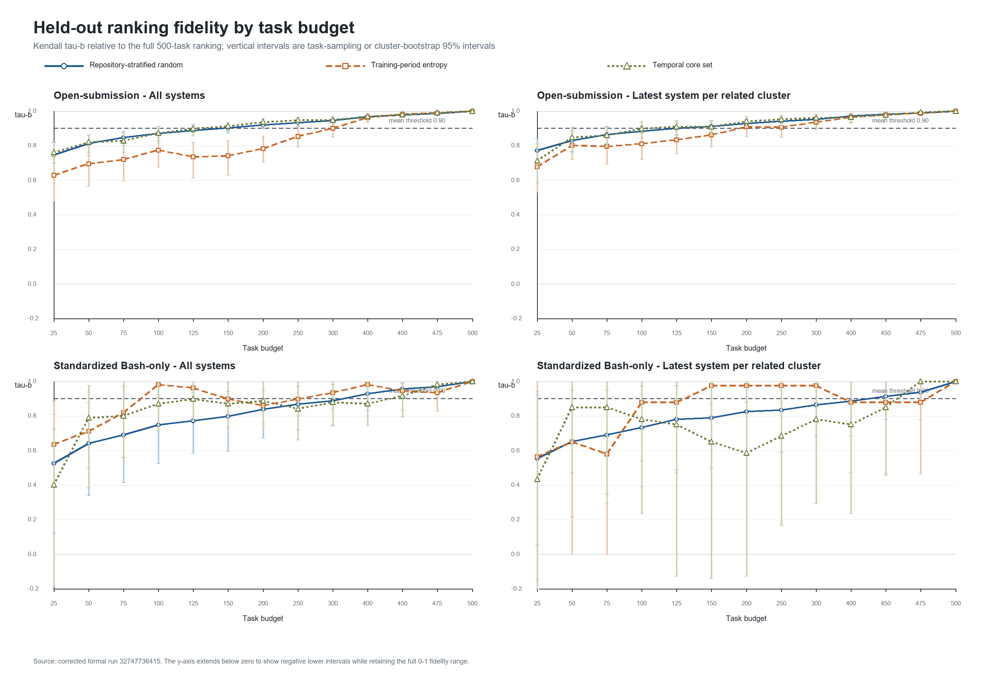

# Limits of Task-Set Reduction in SWE-bench Verified: A Temporal Study of Leaderboard Ranking Reliability

Anonymous manuscript for review

Target journal: *Empirical Software Engineering*

## Abstract

Coding-agent leaderboards are costly measurement systems, which makes smaller
task sets attractive. However, a subset selected from current systems is useful
only if it preserves the ranking of later systems, including when related
system variants are not treated as independent evidence. We study this
time-forward reliability question on the 500 tasks of SWE-bench Verified. Two
execution panels are analyzed separately: heterogeneous open submissions from
2024 to 2025 (51 training-period and 78 held-out systems) and standardized
Bash-only submissions from 2025 to 2026 (27 and 11 systems). Earlier-period
outcomes select task sets at 13 budgets using uniform random sampling,
repository-stratified random sampling, task entropy, and a frozen exploratory
temporal core-set heuristic. Held-out fidelity is measured with tie-aware
Kendall tau-b, repeated task sampling, system-cluster bootstrap intervals, and
a latest-system-per-related-cluster sensitivity analysis. Both panels became
easier over time, while mean task entropy declined clearly only in the
standardized panel. All-system analyses suggested common budgets of 450 tasks
for repository-stratified random sampling, 400 for entropy, and 475 for the
temporal core set. These apparent reductions did not survive the final
dependence-aware rule, which requires one exact budget to pass every panel and
scope. The robust primary budgets were 500, 500, and 475 tasks, respectively.
Entropy admitted 250 tasks only under a lenient sensitivity policy. Its
fidelity was non-monotone: in one held-out scope it passed at 150-300 tasks,
failed at 400-475, and passed again at the 500-task positive control. Thus,
aggressive reduction was not temporally reliable in the observed leaderboard.
Benchmark maintainers should validate task budgets on future systems, model
related-system dependence, and scan exact common budgets instead of assuming
that fidelity improves monotonically with set size.

**Keywords:** coding agents; software engineering benchmarks; SWE-bench
Verified; test-set reduction; leaderboard reliability; temporal validation;
Kendall tau-b

## 1 Introduction

Repository-level coding agents are commonly compared by the fraction of
benchmark tasks they resolve. SWE-bench made this evaluation setting concrete
by connecting real GitHub issues to repository snapshots, pull requests, and
executable tests [1]. SWE-bench Verified subsequently retained 500 tasks after
human review of problem statements and test adequacy [2]. Public leaderboards
then accumulated many submissions that differed in models, scaffolds, dates,
and execution conventions.

Executing fewer tasks is an appealing way to reduce evaluation burden. The
idea resembles test-suite reduction: retain a smaller set that preserves the
property needed by the user [9]. For a leaderboard, however, the relevant
property is not merely task coverage or fault detection. A reduced set must
preserve comparative conclusions among systems. A subset that reproduces the
current ranking can still fail when stronger or differently structured systems
arrive. It can also appear reliable when a leaderboard contains many closely
related variants of the same agent or model provider.

This creates a temporal measurement problem. Suppose task outcomes from an
earlier period are used to choose a subset. The subset is then applied to later
systems, and its induced ranking is compared with the ranking produced by all
500 tasks. The key question is not whether one can fit the observed
leaderboard, but whether the compressed measurement transfers forward. This
distinction matters because benchmarks, tools, and experimental subjects evolve
[6], and because out-of-sample validation and transparent reporting remain
uneven in empirical software engineering [7].

The need for maintenance has become more explicit since the data snapshot used
in this study. In February 2026, OpenAI reported that SWE-bench Verified no
longer provided a suitable signal for frontier coding capabilities because of
residual task flaws and contamination, and recommended moving to newer
evaluations [3]. Our study does not dispute or repair those construct-validity
problems. Instead, it treats the frozen public leaderboard as a historical
measurement system and asks a narrower methodological question: within that
system, how much task reduction preserves later rankings? The distinction
between outcome correctness and ranking fidelity is essential. Work such as
SWE-Bench+ and UTBoost examines whether benchmark tasks and tests correctly
accept solutions [5, 11]; we examine whether a subset of the recorded outcomes
preserves system ordering.

We make four contributions.

1. We formulate task-set reduction as a time-forward ranking-reliability
   problem rather than an in-sample compression problem.
2. We construct two non-pooled temporal panels from frozen official sources,
   reconcile included matrices to public scores, and distinguish all systems
   from the latest system in each related family or provider cluster.
3. We evaluate four selection strategies over 13 budgets with repeated task
   sampling, clustered uncertainty, threshold sensitivity, and a mandatory
   500-task positive control.
4. We report a limitation finding: neither repository-stratified random
   sampling nor entropy supports task reduction under the primary or strict
   common-budget rule, and the exploratory temporal core set supports only a
   5% reduction.

The practical implication is procedural rather than algorithmic. A task subset
should be versioned and revalidated as a benchmark population changes. The
validation must use future systems where possible, account for related
submissions, and avoid monotonicity assumptions that the observed fidelity
curves do not support.

## 2 Background and Related Work

### 2.1 Coding-agent benchmarks and SWE-bench Verified

SWE-bench evaluates whether a model or agent can modify a real repository to
resolve a GitHub issue [1]. The original benchmark contained 2,294 problems
across 12 Python repositories. SWE-bench Verified was built after professional
developers reviewed 1,699 tasks; 500 were selected as a human-validated subset
[2]. The public ecosystem subsequently became a central comparison point for
coding agents.

That ecosystem is heterogeneous. Martinez and Franch [4] characterize the
participants, products, model choices, and openness of SWE-bench leaderboard
entries, showing that leaderboard rows are not interchangeable independent
samples. Our panel design responds by separating the open-submission and
standardized Bash-only formats and by adding related-system sensitivity rather
than pooling every row into one analysis.

The current status of SWE-bench Verified also limits how results should be
read. OpenAI's 2026 audit reports residual test-design problems and evidence of
contamination among frontier models [3]. Consequently, we do not claim that a
preserved historical SWE-bench Verified ranking measures current real-world
software engineering capability. The benchmark is the bounded empirical case
through which we study a general maintenance problem.

### 2.2 Task validity and ranking correction

Benchmark ranking can change when task outcomes are corrected. SWE-Bench+
reports solution leakage, weak tests, and contamination risks [11]. UTBoost
augments tests and identifies patches that had been incorrectly accepted;
those corrections change several SWE-bench leaderboard positions [5]. These
studies address the validity of individual task judgments and are therefore
complementary to our work.

Our input is a frozen binary system-by-task outcome matrix after source-level
quality checks. Given that matrix, we ask whether columns selected from an
earlier system cohort preserve the full-column ranking of a later cohort.
Perfect subset fidelity would not prove that any underlying task is valid.
Conversely, a corrected task suite could still be too small to preserve later
rankings. Task correctness and subset fidelity are separate layers of
measurement validity.

### 2.3 Benchmark and tool evolution

Empirical results can age as tools, configurations, and benchmark populations
change. Golmohammadi et al. [6] show that parameter-tuning conclusions in
search-based software engineering can require periodic re-evaluation as a tool
evolves. The same logic applies to task selection: a subset optimized on an
earlier cohort may no longer distinguish later systems.

The methodological literature also cautions against weak out-of-sample
validation and opaque analysis choices. Destefanis et al. [7] audit machine-
learning experiments in software defect prediction and emphasize design,
analysis, reporting, and reproducibility. Baltes and Ralph [8] show that
sampling and representativeness are frequently misunderstood in software
engineering research. Our response is a frozen time-forward design, explicit
source provenance, repeated sampling, clustered sensitivity, and a decision
rule fixed independently of the observed winning budget.

### 2.4 Test-suite reduction and ranking preservation

Regression-testing research distinguishes minimization, selection, and
prioritization [9]. Those techniques usually aim to retain fault-detection or
change-relevance properties while reducing execution. Coding-agent leaderboard
reduction has a different target: preserving comparative system ordering and
associated top-k decisions. A task can be redundant for one cohort and
discriminative for another.

Rank preservation also requires a statistic that handles ties because many
systems receive identical aggregate scores. We therefore use Kendall tau-b,
which corrects for ties in ranking problems [10]. Tau-b is supplemented by
top-k overlap, pairwise direction agreement, calibrated score error, and
repository coverage. The paper-facing decision is intentionally conservative:
both a central tau-b value and a lower uncertainty bound must pass.

## 3 Research Questions

**RQ1 - Temporal measurement shift.** How do task solve rates, task entropy,
and task-difficulty ordering change between the earlier and later periods of
each execution panel?

**RQ2 - Time-forward ranking fidelity.** When task sets are selected only from
earlier-period outcomes, how faithfully do they reproduce the full 500-task
ranking of later systems across budgets, methods, panels, and dependence
scopes?

**RQ3 - Reliable task budgets.** What is the smallest single task budget that
meets the predeclared ranking-reliability policy in both temporal panels and in
both the all-system and latest-per-related-cluster scopes?

The study does not hypothesize that the entropy selector or temporal core set
must win. The temporal core set is a frozen exploratory heuristic retained to
test whether a more structured selector from the pilot transfers forward.

## 4 Study Design

### 4.1 Frozen sources and unit of observation

The unit of observation is one public submission-task outcome. Canonical task
identifiers come from the official SWE-bench Verified dataset. Outcome matrices
come from the official `swe-bench/experiments` repository, while public scores
and submission metadata come from the official SWE-bench website repository.
All sources are pinned rather than read from moving branch heads.

The final run uses experiments commit
`1faa91cade0562ba62b66c1c99e71f7b72d96f13` and website commit
`f42505b21a0eb31a9cc1204caafcbe0da6c1a259`. The classic and Bash-only outcome
matrices have SHA-256 digests
`e477915c5dd68a132995f692da67b0105743f34bd868f636d3b5fec43c1b11e0` and
`0f5fda63360d75604589e4916057ffc294dd3b4ef6d9cca9552adf651806357d`,
respectively. The reproduction package records every requested URL, exclusion,
source commit, and generated file.

### 4.2 Inclusion and data-quality rules

For the classic source, a submission must have a valid date, be present in the
official leaderboard metadata, expose a canonical resolved-task list, and
reconcile exactly to its published score. Of 134 discovered directories, 133
were usable; one unlisted directory was excluded.

For the standardized Bash-only source, a result file must contain explicit
Boolean outcomes for exactly the 500 canonical tasks. Seven of 47 discovered
directories lacked a valid full matrix, and two more failed score
reconciliation within the predeclared 0.15 percentage-point tolerance. The
remaining 38 were usable. The maximum included difference from a published
score was 0.13 percentage points. No included classic row had a score mismatch.

The pipeline verifies unique canonical identifiers, absence of duplicated
system signatures within each panel period, and completeness of the positive
control. The final data-quality decision was PASS. Table 1 summarizes the
source audit.

**Table 1. Source inclusion and data-quality summary.**

| Source format | Discovered directories | Usable matrices | Main exclusions | Maximum included score difference |
|---|---:|---:|---|---:|
| Open/classic | 134 | 133 | 1 unlisted submission | 0.00 pp |
| Standardized Bash-only | 47 | 38 | 7 missing/invalid full matrices; 2 score mismatches | 0.13 pp |

### 4.3 Temporal panels

The panels represent different execution conventions and are never pooled for
inferential claims.

**Open-submission panel.** Task selection uses 51 systems submitted in 2024;
evaluation uses 78 systems submitted in 2025. Agent-family metadata defines 28
training-period and 51 held-out clusters. Because 2025 outcomes were inspected
during pilot development, this panel is treated as developmental evidence.
The top-k diagnostic uses k=10.

**Standardized Bash-only panel.** Task selection uses 27 systems from 2025;
evaluation uses 11 systems from 2026. Model-provider metadata defines 10 and 7
clusters. The result files share the standardized mini-SWE-agent Bash-only
format and explicitly report all 500 task outcomes. This panel is the time-
external replication. The top-k diagnostic uses k=5.

**Table 2. Temporal panel design.**

| Panel | Earlier period | Later period | Systems | Cluster field | Clusters | Top-k |
|---|---:|---:|---:|---|---:|---:|
| Open-submission | 2024 | 2025 | 51 -> 78 | Agent family | 28 -> 51 | 10 |
| Standardized Bash-only | 2025 | 2026 | 27 -> 11 | Model provider | 10 -> 7 | 5 |

### 4.4 Task-selection methods

All selectors use only the earlier-period outcomes of the relevant panel and
dependence scope.

**Uniform random sampling** draws tasks without replacement and serves as a
descriptive baseline.

**Repository-stratified random sampling** allocates a budget proportionally
across the 12 task repositories using largest remainders, then samples without
replacement within each repository. This is the paper-facing stochastic
baseline because repository coverage is a basic structural constraint.

**Training-period entropy** ranks tasks by binary entropy of their earlier-
period solve rate, with canonical task identifier as the deterministic tie
breaker. It selects tasks closest to a 50% solve rate, which are maximally
uncertain for that earlier cohort.

**Temporal core set** is a frozen exploratory selector. It stratifies by
repository and one of five earlier-period difficulty bins, allocates the budget
proportionally, and greedily combines three signals: discrimination
`4p(1-p)`, stability between the first and second halves of the earlier period,
and Hamming diversity of task outcome signatures. Discrimination and stability
receive 75% of the score and signature diversity 25%. The heuristic is not
claimed as a novel or successful algorithm.

### 4.5 Budgets, scopes, and outcomes

We evaluate 13 budgets: 25, 50, 75, 100, 125, 150, 200, 250, 300, 400, 450,
475, and 500 tasks. The 500-task endpoint must reproduce the full ranking
exactly and is a mandatory positive control.

Every panel is evaluated in two scopes. The **all-systems** scope retains all
eligible leaderboard rows. The **cluster-latest** scope retains only the latest
eligible system in each agent-family or model-provider cluster, reducing the
influence of closely related variants. Clustering is an approximation, not a
claim that all within-cluster systems are statistically exchangeable.

The primary outcome is Kendall tau-b between later-period aggregate scores on
the full 500 tasks and on the selected subset. Tau-b is tie-aware [10].
Secondary outcomes are top-k overlap, pairwise direction agreement, calibrated
score mean absolute error, repository coverage, and the percentile of a
deterministic selector relative to repository-stratified random sampling.

### 4.6 Repetition and uncertainty

Uniform and repository-stratified random sampling use 500 deterministic-seed
repetitions per budget, panel, and scope. Their displayed 2.5th and 97.5th
percentiles describe task-sampling variation.

Entropy and temporal core-set selection are deterministic for a fixed earlier
cohort. For these methods, we bootstrap later systems by their related-system
cluster 1,000 times and recompute tau-b. This preserves within-cluster
dependence during resampling. RQ1 changes in solve rate and entropy use 2,000
repository-cluster bootstrap repetitions over tasks, where the repository is
the resampling cluster.

### 4.7 Reliability policies and exact common budgets

Under the primary policy, a repository-stratified random row passes when mean
held-out tau-b is at least 0.90 and its task-sampling 2.5th percentile is at
least 0.85. A deterministic row passes when tau-b is at least 0.90 and its
system-cluster-bootstrap 2.5th percentile is at least 0.80.

The final decision is the smallest **single exact budget** that passes every
combination of panel and scope. The algorithm scans candidate budgets in
ascending order. It does not take the maximum of cell-specific minimum passing
budgets. That shortcut would be valid only if pass/fail status were monotone in
budget, an assumption contradicted by the observed deterministic curves.

Two sensitivity policies are also fixed. The lenient policy uses mean tau-b
0.85, stochastic lower bound 0.80, and deterministic lower bound 0.75. The
strict policy uses 0.95, 0.90, and 0.85. These policies assess threshold
dependence; they are not selected to obtain a favorable budget.

## 5 Results

### 5.1 RQ1: Both panels became easier, but entropy changed differently

Mean task solve rate increased in both panels (Table 3 and Figure 1). In the
open-submission panel, the increase was 0.236 with a repository-bootstrap 95%
interval from 0.213 to 0.261. Mean task entropy decreased by 0.049, but its
interval (-0.096 to 0.029) crossed zero. We therefore do not interpret the open
panel as showing a clear entropy decline.

In the standardized Bash-only panel, mean solve rate increased by 0.158
(0.125 to 0.175), while entropy decreased by 0.292 (-0.332 to -0.203). The
later standardized systems solved more tasks on average, but a larger share of
tasks became weakly discriminative or nearly saturated. The tau-b correlation
between earlier- and later-period task difficulty was 0.791 in the open panel
and 0.713 in the standardized panel, indicating substantial but incomplete
stability of task ordering.

**Table 3. Later-minus-earlier temporal changes.**

| Panel | Systems | Solve-rate change [95% interval] | Entropy change [95% interval] | Task-difficulty tau-b |
|---|---|---|---|---:|
| Open-submission | 51 -> 78 | +0.236 [+0.213, +0.261] | -0.049 [-0.096, +0.029] | 0.791 |
| Standardized Bash-only | 27 -> 11 | +0.158 [+0.125, +0.175] | -0.292 [-0.332, -0.203] | 0.713 |

**Figure 1. Temporal changes in mean task solve rate and binary entropy.**

**Answer to RQ1.** Both held-out cohorts solved more tasks on average. A clear
loss of task entropy was observed only in the standardized panel, and task
difficulty ordering changed enough to make earlier-period task selection a
non-trivial transfer problem.

### 5.2 RQ2: In-panel fidelity does not imply time-external reliability

Figure 2 shows held-out ranking fidelity for the three paper-facing methods.
The developmental open panel gives an optimistic picture. In the all-system
scope, the first passing budgets are 150 tasks for repository-stratified random
sampling, 400 for entropy, and 150 for the temporal core set. The standardized
panel is markedly more demanding: corresponding all-system budgets are 450,
100, and 475 tasks.

The divergent entropy budgets illustrate why a single-panel result is not a
general recommendation. Entropy performs well at 100 tasks in the standardized
all-system scope, but the same selector needs 400 tasks in the open panel.
Conversely, methods that appear adequate at 150 tasks in the open panel require
450 or 475 tasks in the standardized panel. The cross-panel all-system exact
budgets are consequently 450 for repository-stratified random, 400 for
entropy, and 475 for the temporal core set.

Dependence sensitivity changes the curves further. In the standardized panel,
repository-stratified random sampling passes at 450 tasks with all systems
(mean tau-b 0.956; 2.5th percentile 0.897), but fails at the same budget after
retaining one system per provider cluster (0.914; 0.781). It reaches the
positive control at 500 tasks. The apparent 10% random-sampling reduction is
therefore attributable to a scope that gives repeated related systems more
weight.

**Figure 2. Held-out Kendall tau-b by task budget, panel, scope, and method.**
The y-axis includes the full 0-1 fidelity range and extends to -0.2 so negative
lower intervals remain visible. The dashed horizontal line is the primary mean
threshold of 0.90; passing also requires the method-specific lower bound.

**Table 4. First passing budgets within each panel and scope.**

| Panel and scope | Repository-stratified random | Entropy | Temporal core set |
|---|---:|---:|---:|
| Open, all systems | 150 | 400 | 150 |
| Open, cluster latest | 150 | 400 | 150 |
| Standardized, all systems | 450 | 100 | 475 |
| Standardized, cluster latest | 500 | 300 | 475 |

These cell-specific minima are descriptive. They cannot be aggregated by
taking their maximum because a method can pass at a smaller budget and fail at
a larger one.

**Answer to RQ2.** Ranking fidelity varies materially by later cohort and by
the treatment of related systems. Budgets that appear adequate in the
developmental panel do not transfer reliably to the standardized time-external
panel.

### 5.3 RQ3: The robust primary budgets are 500, 500, and 475 tasks

Figure 3 applies the primary rule at each exact budget and counts the number of
passing panel-scope cells. Repository-stratified random sampling first passes
all four cells only at 500 tasks. Entropy also first passes all four at 500.
The temporal core set first passes all four at 475 tasks and therefore supports
only a 5% reduction.

**Figure 3. Number of panel-scope cells passing the primary policy at each
exact budget.** Gold outlines identify the first 4/4 budget.

The entropy result deserves closer inspection. In the standardized cluster-
latest scope, entropy passes at 150, 200, 250, and 300 tasks. At 300 tasks,
tau-b is 0.976 and the cluster-bootstrap 2.5th percentile is 0.882. It then
fails at 400, 450, and 475 tasks. At 400 tasks, tau-b falls to 0.878 and the
lower bound to 0.471, although top-5 overlap remains 1.0. At 500 tasks, all
metrics return to 1.0. Thus, a larger nested entropy subset can preserve the
top group while changing enough pairwise orderings and ties to fail the global
rank criterion.

This non-monotonicity explains why the all-system cross-panel entropy budget of
400 does not survive the robust rule. The open cells pass at 400, but the
standardized cluster-latest cell does not. Only the 500-task endpoint passes
all cells simultaneously.

**Table 5. Final exact common-budget decisions.**

| Method | All-system cross-panel budget | Final robust budget | Reduction from 500 |
|---|---:|---:|---:|
| Repository-stratified random | 450 | **500** | **0%** |
| Training-period entropy | 400 | **500** | **0%** |
| Temporal core set | 475 | **475** | **5%** |

**Answer to RQ3.** Under the primary policy, neither repository-stratified
random sampling nor entropy supports task reduction. The temporal core set
supports only a marginal 25-task reduction.

### 5.4 Threshold sensitivity

The main negative finding is stable under the strict policy (Table 6). Both
repository-stratified random sampling and entropy require 500 tasks, and the
temporal core set requires 475. Under the lenient policy, entropy admits a
250-task exact common budget, corresponding to a 50% task reduction. This
shows that an operational user willing to accept lower mean and lower-bound
fidelity could choose a much smaller entropy subset, but that choice is a
different reliability policy and cannot replace the primary conclusion.

**Table 6. Exact common budgets under fixed sensitivity policies.**

| Policy | Repository-stratified random | Entropy | Temporal core set |
|---|---:|---:|---:|
| Lenient | 500 (0%) | 250 (50%) | 475 (5%) |
| Primary | 500 (0%) | 500 (0%) | 475 (5%) |
| Strict | 500 (0%) | 500 (0%) | 475 (5%) |

## 6 Discussion

### 6.1 The publishable result is a limit, not a selector victory

The developmental panel can support an attractive 150-task narrative for
selected methods. That narrative fails under the standardized time-external
panel and related-system sensitivity. The robust result is consequently a
limitation finding: the available public evidence does not justify aggressive
task-set reduction under the primary reliability policy.

Entropy remains a useful diagnostic baseline. It is simple, deterministic,
and can perform well under a lenient policy. Yet it is not a robust primary-
policy solution, and the present study does not claim algorithmic novelty. The
temporal core set likewise does not justify a method paper: its final saving is
only 5%, despite its additional structure.

Negative evidence is operationally valuable. A benchmark maintainer who
adopted the developmental 150-task result would risk a materially different
later leaderboard. Reporting that failure prevents a fragile optimization
from becoming infrastructure.

### 6.2 More tasks do not guarantee greater rank fidelity

The non-monotone entropy curve is the study's main analytical warning. Even
though entropy subsets are nested as the budget grows, the induced system
ranking need not improve monotonically. Adding tasks can alter score ties and
pairwise differences in directions that temporarily reduce tau-b. A decision
procedure that takes the maximum of cell-specific minimum passing budgets
silently assumes monotonicity and can therefore select a budget that fails one
of its required cells.

The safe aggregation rule is computationally simple: enumerate the candidate
budgets and test every required panel-scope cell at the same exact budget. If
budgets are continuous or numerous, an implementation can still exploit
structure, but it must not assume nesting of task sets implies monotonicity of
the decision metric.

### 6.3 Implications for benchmark maintenance

We recommend a versioned maintenance cycle.

1. Freeze source commits, task identifiers, outcome matrices, and metadata.
2. Select candidate task sets only from an earlier system cohort.
3. Validate on later systems in each execution environment separately.
4. Add dependence-aware scopes for agent families, providers, or shared
   scaffolds.
5. Evaluate exact common budgets with uncertainty and a full-benchmark positive
   control.
6. Re-run the protocol when the system population, harness, or benchmark
   materially changes.

This cycle parallels calls to re-evaluate empirical configurations as tools and
benchmarks evolve [6]. It also makes the reliability policy an explicit
governance choice. A maintainer may prefer a lenient budget for rapid internal
screening and retain the full benchmark for public ranking. What should be
avoided is presenting the smaller screening set as if it preserved the
primary-policy leaderboard.

### 6.4 Evaluation burden is not proportional cost

The task-reduction percentages in Tables 5 and 6 are counts, not measured
runtime or monetary savings. Coding-agent evaluation includes repository setup,
container creation, dependency installation, caching, retries, and fixed
coordination overhead. Removing 5% or 50% of tasks need not reduce total cost by
the same proportion. A deployment decision requires a separate cost model with
observed per-task and fixed costs.

### 6.5 Relevance after SWE-bench Verified's deprecation

The official 2026 warning means SWE-bench Verified should not be treated as a
current frontier capability measure [3]. This narrows the direct operational
recommendation: we do not propose a new permanent subset of SWE-bench Verified.
However, the warning strengthens the broader maintenance motivation. A
benchmark can lose construct validity while its task discrimination and system
population also evolve. Newer coding-agent benchmarks will face the same
temptation to reduce task sets. They should evaluate outcome correctness and
time-forward ranking fidelity as distinct gates.

## 7 Threats to Validity

### 7.1 Construct validity

The primary construct is preservation of a full-benchmark ranking, not real-
world software engineering ability. If the full benchmark contains flawed,
contaminated, or unrepresentative tasks, high subset fidelity reproduces those
limitations. Recent audits make this threat concrete [3, 5, 11]. Tau-b captures
global ordering with ties, but a user may care more about a specific decision
such as top-5 membership. We report top-k and pairwise diagnostics, yet the
predeclared decision remains tau-b based.

The public score is a single binary-outcome aggregate. It does not represent
patch quality, maintainability, efficiency, or repeated-run reliability.

### 7.2 Internal validity

Source formats differ between panels. We mitigate this by analyzing them
separately, requiring exact canonical identifiers, reconciling scores, and
pinning commits. Submission date is an imperfect proxy for evaluation time and
does not identify the exact harness version. Metadata-derived clusters may
merge distinct systems or fail to join related systems. The cluster-latest
analysis is therefore a sensitivity analysis rather than a definitive causal
model of dependence.

Random baselines use finite repetitions and bootstrap intervals use finite
resamples. The chosen counts (500, 1,000, and 2,000) balance stability and
reproducibility; alternative seeds may change boundary values slightly. The
500-task positive control and deterministic seeds protect against gross
pipeline failures.

The thresholds are normative reliability policies rather than estimates of a
universal acceptable tau-b. We expose lenient and strict policies to show how
the conclusion depends on that choice.

### 7.3 Conclusion validity

The standardized held-out panel contains only 11 systems and seven provider
clusters, which yields wide cluster-bootstrap intervals and limited power.
Those wide intervals are part of the reliability question rather than noise to
be ignored: a smaller task set is difficult to certify when the independent
system population is small. Still, future standardized submissions could
change the exact budgets.

We make no causal claim that time, model scale, or agent design caused the
observed solve-rate or entropy changes. The panels are observational snapshots
of a self-selected public leaderboard.

### 7.4 External validity

The study covers one 500-task Python benchmark and two SWE-bench execution
formats. Results do not generalize numerically to other benchmarks, languages,
task types, or private systems. Public submissions over-represent teams willing
to publish results and may contain repeated variants. Sampling limitations of
software engineering corpora are well documented [8].

The current deprecation of SWE-bench Verified further limits direct use of the
specific subsets. The transferable result is the validation protocol and the
demonstrated failure of monotone common-budget aggregation, not the claim that
475 or 500 tasks is a universal coding-agent requirement.

## 8 Reproducibility

The reproduction package contains the complete standard-library Python
pipeline, configuration, tests, frozen source manifest, data-quality report,
208 metric rows, longitudinal summaries, threshold-sensitivity table, selected
task identifiers, and an HTML diagnostic report. The official corrected run is
GitHub Actions run 32747736415 at commit
`5d012416189c888948c99b3544e4f8cf4175b165`. Its artifact SHA-256 is
`deb302cb6b41eeddbc17e066a6535e485e7c7a1be9a98b58115bd3df4c26793b`.

Sixteen unit tests cover metric boundaries, exact subset sizes, source parsing,
the full-benchmark positive control, cluster handling, decision thresholds,
and the non-monotone common-budget regression. The final artifact contains 208
unique panel-scope-method-budget rows, no duplicate cells, and no missing
primary rank metrics. The 500-task positive control contains all eight expected
panel-scope-method rows and no failures.

The upstream binary outcome matrices are not redistributed. The source
manifest records immutable URLs and commits so a reproducer can recollect them.
This choice respects upstream data ownership while retaining an auditable chain
from source to result.

## 9 Conclusion

Task-set reduction for a coding-agent leaderboard must be evaluated as a
future-ranking problem. In two temporal SWE-bench Verified panels, budgets that
looked sufficient in a developmental cohort weakened under later standardized
systems and related-system sensitivity. Under the primary and strict policies,
repository-stratified random sampling and training-period entropy both required
all 500 tasks. The exploratory temporal core set required 475 tasks, a 5%
reduction. Entropy supported 250 tasks only under a lenient alternative policy.

The observed non-monotonicity is consequential: a larger deterministic subset
can fail after a smaller one passes. Common-budget decisions must therefore
test one exact budget across every required panel and dependence scope rather
than aggregate cell-specific minima. More broadly, benchmark subsets should be
versioned, validated on later systems, and re-evaluated as tasks, harnesses, and
system populations change. The result is not a recommended permanent subset of
SWE-bench Verified, which is no longer a suitable frontier benchmark [3]. It is
a reproducible warning about the limits of one-time benchmark compression.

## References

[1] Jimenez, C. E., Yang, J., Wettig, A., Yao, S., Pei, K., Press, O., and
Narasimhan, K. (2024). SWE-bench: Can Language Models Resolve Real-World
GitHub Issues? *International Conference on Learning Representations*.

[2] OpenAI (2024, updated 2025). Introducing SWE-bench Verified.
https://openai.com/index/introducing-swe-bench-verified/

[3] OpenAI (2026). Why SWE-bench Verified no longer measures frontier coding
capabilities.
https://openai.com/index/why-we-no-longer-evaluate-swe-bench-verified/

[4] Martinez, M., and Franch, X. (2026). What's in a Benchmark? The Case of
SWE-Bench in Automated Program Repair. *Proceedings of ICSE-SEIP 2026*,
647-658. https://doi.org/10.1145/3786583.3786904

[5] Yu, B., Zhu, Y., He, P., and Kang, D. (2025). UTBoost: Rigorous Evaluation
of Coding Agents on SWE-Bench. *Proceedings of ACL 2025*, 3762-3774.
https://doi.org/10.18653/v1/2025.acl-long.189

[6] Golmohammadi, A., Zhang, M., and Arcuri, A. (2026). Tools and benchmarks
evolve: what is their impact on parameter tuning in SBSE experiments?
*Empirical Software Engineering*, 31, 8.
https://doi.org/10.1007/s10664-025-10733-y

[7] Destefanis, G., Yousefi, L., Shepperd, M., Tucker, A., Swift, S., Counsell,
S., and Arzoky, M. (2026). An audit of machine learning experiments on software
defect prediction. *Empirical Software Engineering*, 31, 83.
https://doi.org/10.1007/s10664-025-10797-w

[8] Baltes, S., and Ralph, P. (2022). Sampling in software engineering
research: a critical review and guidelines. *Empirical Software Engineering*,
27, 94. https://doi.org/10.1007/s10664-021-10072-8

[9] Yoo, S., and Harman, M. (2012). Regression testing minimization, selection
and prioritization: a survey. *Software Testing, Verification and Reliability*,
22(2), 67-120. https://doi.org/10.1002/stvr.430

[10] Kendall, M. G. (1945). The treatment of ties in ranking problems.
*Biometrika*, 33(3), 239-251. https://doi.org/10.1093/biomet/33.3.239

[11] Aleithan, R., Xue, H., Mohajer, M. M., Nnorom, E., Uddin, G., and Wang,
S. (2024). SWE-Bench+: Enhanced Coding Benchmark for LLMs. arXiv:2410.06992.
https://arxiv.org/abs/2410.06992
